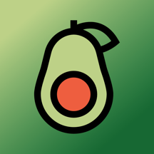
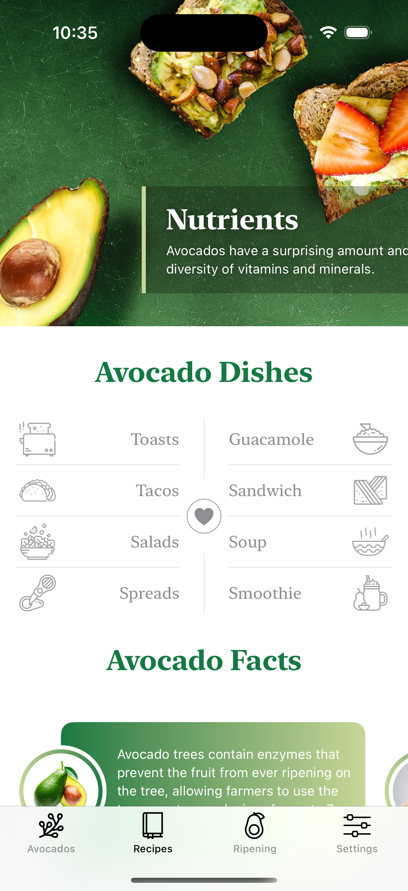
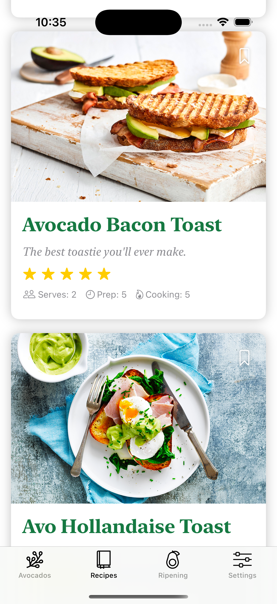
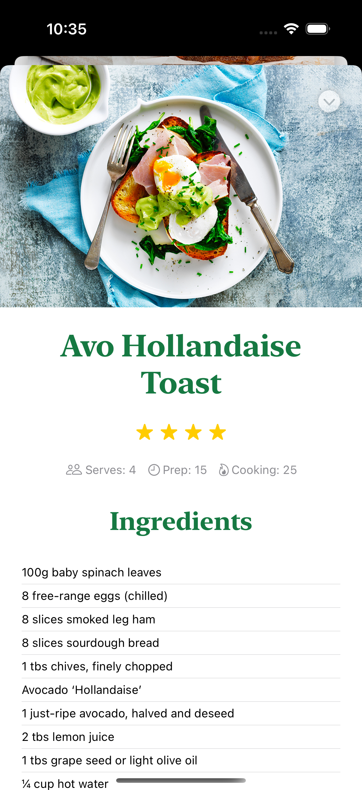
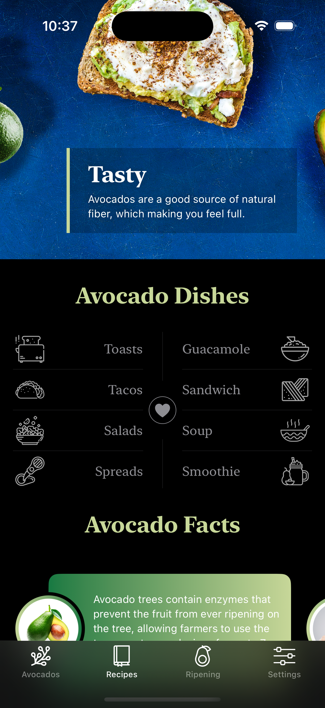

  

# Avocados Recipes

---

## 📱 About the App
Avocados recipes is an application developed for learning purposes, the goal is create an recipes App but stylized and include more info to the user.

## 📸 Screenshots

  
  
  
  
  

## 📸 iPad

  
  

### ✨ Features
- **Stylized user interface**: A user interface designed to captivate users with a customized color palette.
- **Sheets**: Use of sheets to show recipes.
- **Dark mode**: The App support dark mode using a stylized layout
- **SwiftUI**: In-depth use of SwiftUI to create reusable elements.
- **Animation**: Simple but beautiful animations. 

## 🔧 Technologies Used
Avocados recipes is built using the following main technologies:

| Technology       | Description                                       |
| ---------------- | ------------------------------------------------- |
| **SwiftUI**       | In-depth use of SwiftUI implementing multiple elements |
| **Animation** | Create simple animation to highlight elements |
| **iPhone and iPad** | This project use a flexible layout that works perfectly in iPhone and iPad |

This App is created using resources from "The Complete iOS 18 App Development Course with SwiftUI From Beginner to Advanced App Developer with Xcode and SwiftData" in Udemy (https://www.udemy.com/course/swiftui-masterclass-course-ios-development-with-swift/?couponCode=ST2MT110724BNEW)
